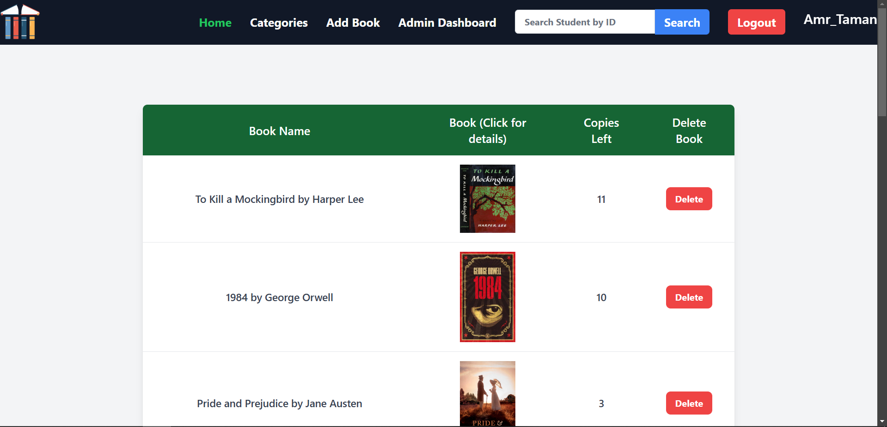
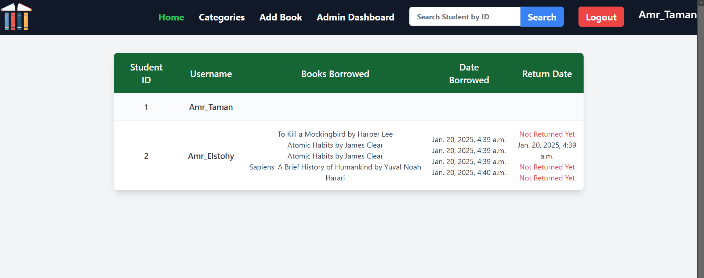
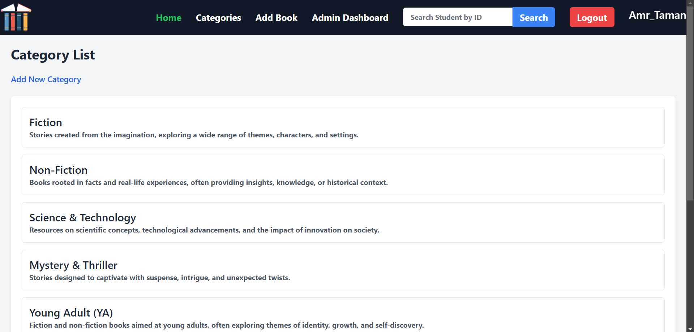

# **Reader: Online Library Simulator** 📚

**Reader** is an online library system simulator developed as **portfolio Project** for the **ALX Software Engineering Program**. This project showcases my ability to build scalable, user-friendly web applications using modern technologies. The application allows students to manage their library activities, such as borrowing and returning books, while providing admins with powerful tools to manage users, books, and categories.

---

## **Features**

### **For Students**:
- **User Authentication**: Sign up, log in, and manage your account.
- **Borrow Books**: Browse and borrow books from the library.
- **View Borrowed Books**: See all the books you’ve borrowed in your profile.
- **Return Books**: Return books once you’re done with them.
- **Edit Profile**: Update your photo, name, email, and password.

### **For Admins**:
- **Admin Dashboard**: View all registered users and their activities.
- **User Activity**: Track which books users have borrowed, when they borrowed them, and if they’ve returned them.
- **Manage Books**: Add, edit, or delete books (including images, names, descriptions, and categories).
- **Manage Categories**: Create, edit, and view categories, and see which books belong to each category.

---

## **Technologies Used**

### **Frontend**:
- **HTML**, **CSS**, **Tailwind CSS**, **JavaScript**

### **Backend**:
- **Python** (Django)

### **Database**:
- **PostgreSQL**

---

## **Screenshots**

### Home


### Admin Dashboard


### Book Categories


---

## **Setup Instructions**

### **Step 1: Clone the Repository**
```bash
git clone https://github.com/AmrTaman/Reader.git
cd Reader
```

### **Step 2: Install Dependencies**
```bash
pip install -r requirements.txt
```

### **Step 3: Set Up the Database**
1. Create a PostgreSQL database.
2. Update the `DATABASES` setting in `settings.py` with your database credentials.

### **Step 4: Run Migrations**
```bash
python manage.py migrate
```

### **Step 5: Create a Superuser (Admin)**
```bash
python manage.py createsuperuser
```

### **Step 6: Run the Development Server**
```bash
python manage.py runserver
```

Visit `http://127.0.0.1:8000/` in your browser to access the application.

## **Authors**

- **[Amr Taman](https://github.com/AmrTaman)**

- **[Amr Elstohy](https://github.com/amrelstohy)**

